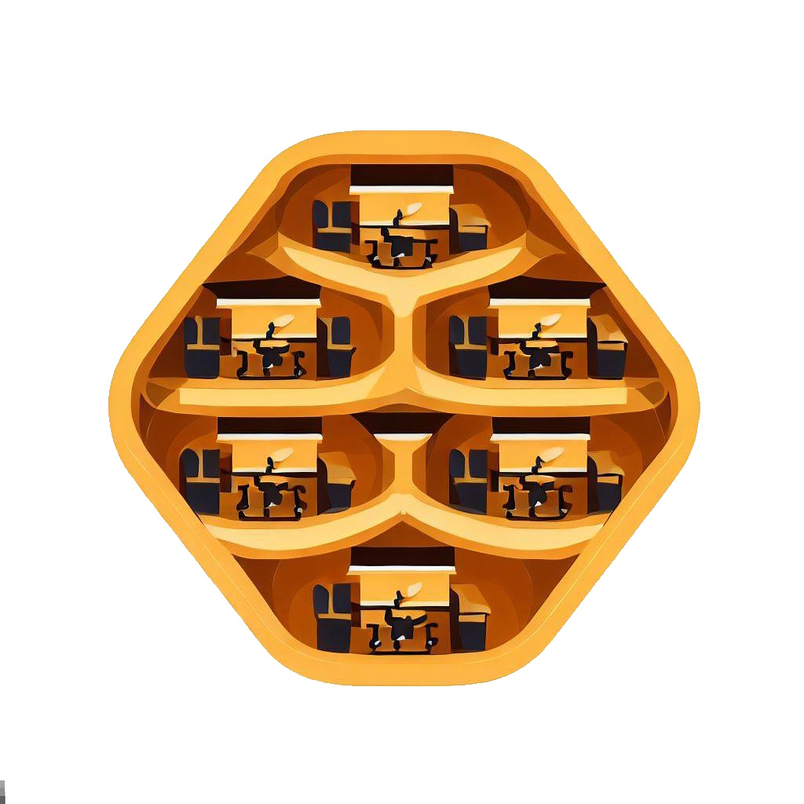

# Work Hive

## **Loghi**

Una selezione di possibili loghi.

Si basano tutti sull'idea di alverare come luogo di aggregazione e ritrovo.

## **L'idea**

Work Hive nasce come una piattaforma con lo scopo di abilitare e favorire l'incontro tra colleghi in orario lavorativo o extra-lavorativo.

In un epoca in cui il lavoro da remoto e' diventa la norma in moltissime realta' nasce il problema di promuovere e favorire i momenti di aggregazione sociale tra i colleghi.

Ma in che modo si puo' risolvere questa necessita'?

### **Condivisione della posizione in tempo reale**

Nel caso un utente decida di lavorare da un postazione di co-working o da una qualsiasi attivita' commerciale che metta a disposizione questo tipo di servizio, tramite WorkHive, e' possibile condividere la propria posizione in tempo reale.

In questo modo altri colleghi che lavorano nei pressi della posizione hanno la possibilita' di saperlo e unirsi per la giornata di lavoro.

### **Pianificazione di giornate di lavoro fuori casa**

Tramite WorkHive e' anche possibile pianificare una giornata di lavoro presso uno spazio che offre servizi di co-working.

Per esempio se un utente e' gia' a conoscenza che un determinato giorno lavorera' in un determinato luogo, tramite WorkHive, ha la possibilita' di condividere questo tipo di evento cosi' che altri utenti possano saperlo e aggregarsi.

### **Pinanificare attivita' extra lavorative**

Analogamente alla pianificazione di giornate di lavoro fuori casa e' anche possibile pianificare attivita' extra lavorative.

Questo puo' essere visto come un utile strumento per creare legami tra i vari dipendenti, utile anche per organizzare eventi di team building in modo spontaneo.

Questa funzione si puo' integrare con la precendente, immaginiamo il caso in cui un utente si rechi in un altra citta' per partecipare a un concerto serale e decida di spendere la giornata lavorativa in un locale di co-working, tramite WorkHive e' possibile pianificare questo tipo di giornate.

### **Condividere una postazione di lavoro presso un edificio privato**

Un altra feature che WorkHive mette a disposizione e' quella di condividere una postazione di lavoro presso un edificio privato, idealmente il proprio domicilio.

## **Funzioni**

### **Pianificazione di giornate di lavoro fuori casa**

In questo caso gli utenti hanno la possibilita' di creare un "evento" che rappresenta l'intenzione di spendere la giornata presso un determinato luogo.
Questo evento e' composto da una data, un orario di inizio, un  orario di fine, un luogo, una descrizione e un numero di partecipanti massimo (opzionale).

### **Pinanificare attivita' extra lavorative**

Questo caso e' analogo al precedente, cambia semplicemente il tipo di attivita' rappresentata, in aggiunta si ha la possibilita' di collegare un evento del tipo precedente cosi' da creare una catena di eventi collegati.

## Descrizione della soluzione

WorkHive e' pensato come un installazione on premise per ogni cliente.
Prevede un integrazione con un active directory necessaria per gestire gli utenti, gruppo e annessi privilegi.

E' anche possibile abilitare e disabilitare determinate feature usando il Feature Flag pattern.
